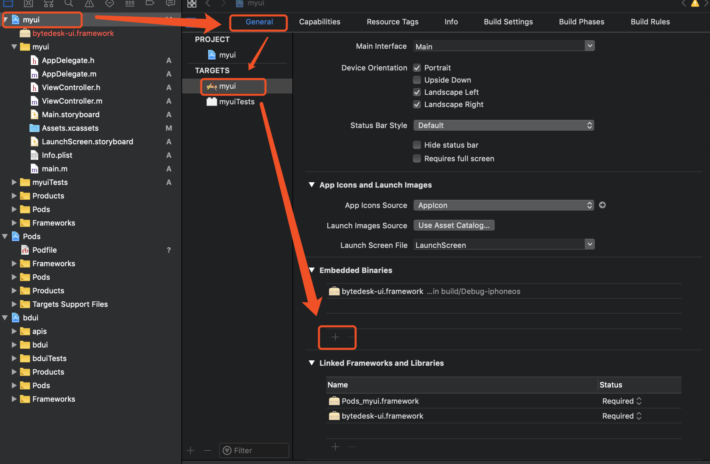
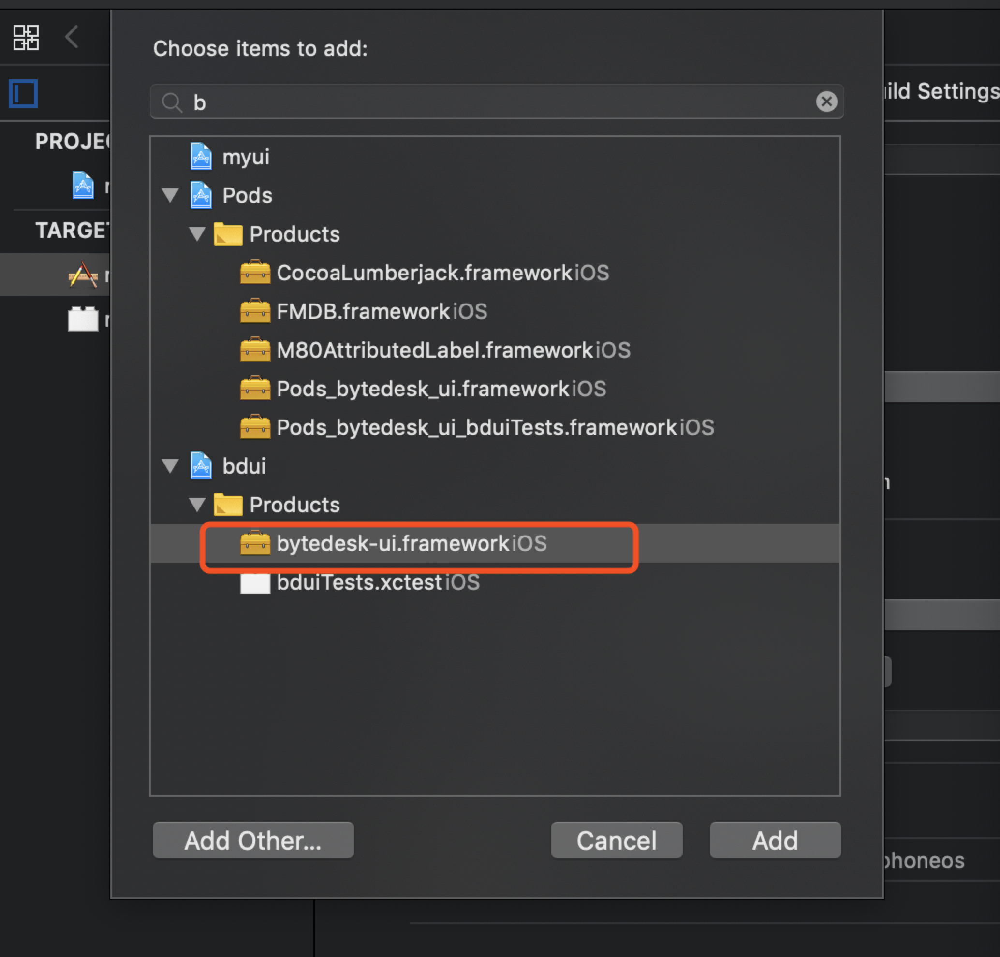
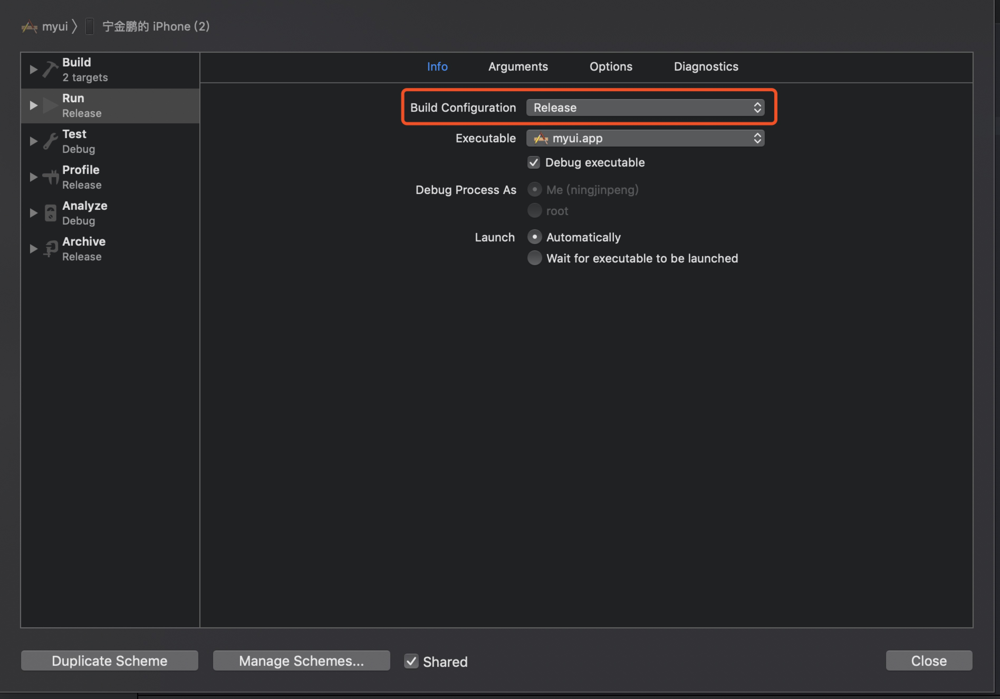

# 5分钟集成在线客服

- [Demo](https://github.com/Bytedesk/bytedesk-ios/tree/master/Tutorial/myui)

## 准备工作

- 到[萝卜丝官网](https://www.bytedesk.com/admin#/register)注册管理员账号，并登录管理后台。
- 到 所有设置->应用管理->App 添加应用，填写相关信息之后点击确定，在生成记录中可见appkey，后面会用到。
- 到 所有设置->客服管理->客服账号 添加客服账号。注意：生成记录中有一列 ‘唯一ID(uid)’ 会在指定客服接口中使用
- 到 所有设置->客服管理->技能组 添加技能组，并可将客服账号添加到相关技能组。注意：生成记录中有一列 ‘唯一ID（wId）’ 会在工作组会话中用到

## 开始集成

> 第一步：拷贝 bdui 库到自己项目目录中，例如：

```md
.
├─ bdui
│  └─ *
├─ myui
├─ myuiTests
├─ Pods
├─ myui.xcodeproj
├─ myui.xcworkspace
├─ Podfile
└─ Podfile.lock
```

> 第二步：添加pod库

```md
# 如果pod库原先没有添加workspace的话，需要添加，如：
platform :ios, '9.0'
# 注意: 'myui' 需要修改为自己项目真实的名称
workspace 'myui'
```

在需要引入在线客服的项目pod中添加

```md

# 第三方依赖
pod 'FMDB'
pod 'WCDB'
pod 'MMKV'
pod 'MQTTClient'
pod 'AFNetworking'
pod 'QMUIKit'
pod 'M80AttributedLabel'
pod 'HCSStarRatingView'
pod 'CocoaLumberjack'

# 集成萝卜丝核心协议库core
pod 'bytedesk-core'
```

添加bdui相关pod

```md
target 'bytedesk-ui' do
  # Comment this line if you're not using Swift and don't want to use dynamic frameworks
  use_frameworks!

  project 'bdui/bdui.xcodeproj'

  # Pods for bdui
  pod 'FMDB'
  pod 'WCDB'
  pod 'MMKV'
  pod 'MQTTClient'
  pod 'AFNetworking'
  pod 'QMUIKit'
  pod 'M80AttributedLabel'
  pod 'HCSStarRatingView'
  pod 'CocoaLumberjack'

  # 集成核心协议库core
  pod 'bytedesk-core'

  target 'bduiTests' do
  end

end
```

支持bitcode

```md
#bitcode enable
post_install do |installer|
  installer.pods_project.targets.each do |target|
    target.build_configurations.each do |config|
      config.build_settings['ENABLE_BITCODE'] = 'YES'

      if config.name == 'Release'
        config.build_settings['BITCODE_GENERATION_MODE'] = 'bitcode'
        else
        config.build_settings['BITCODE_GENERATION_MODE'] = 'marker'
      end

      cflags = config.build_settings['OTHER_CFLAGS'] || ['$(inherited)']

      if config.name == 'Release'
        cflags << '-fembed-bitcode'
        else
        cflags << '-fembed-bitcode-marker'
      end

      config.build_settings['OTHER_CFLAGS'] = cflags
    end
  end
end
```

添加完毕之后，关闭Xcode，执行 `pod install`

> 第三步：项目添加bytedesk-ui.framework





> 第四步：在AppDelegate.m文件中添加头文件

```c
#import <bytedesk-core/bdcore.h>
```

> 第五步：在AppDelegate.m建立萝卜丝长连接

```c
// 1. 在 - (BOOL)application:(UIApplication *)application didFinishLaunchingWithOptions:(NSDictionary *)launchOptions中添加
// 2. 在 - (void)applicationWillEnterForeground:(UIApplication *)application中添加
// anonymouseLogin函数代码请查看AppDelegate.m文件
[self anonymouseLogin];
```

> 第六步：在ViewController.m中添加头文件

```c
#import <bytedesk-ui/bdui.h>
```

> 第七步：在ViewController.m打开在线客服会话窗口

```c
[BDUIApis pushWorkGroupChat:self.navigationController withWorkGroupWid:DEFAULT_TEST_WID withTitle:kDefaultTitle];
```

> 第八步：在Info.plist添加 相册 + 拍照 权限，可参考demo

> 第九步：如果要在真机运行，需要修改项目Scheme为Release



## 集成完毕
